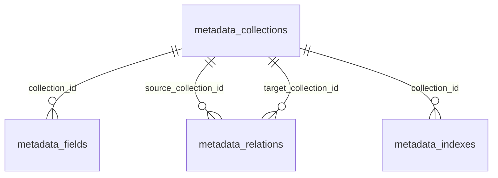

# 元数据系统 — 数据库 Schema 设计

> 迁移自 `intellecXplore-paas-old` 设计方案，适配本项目 Drizzle ORM + PostgreSQL 约定。

---

## 设计概述

元数据驱动架构的核心模块，通过元数据定义自动生成表单、CRUD 以及数据库物理表。四张表构成一套完整的「Collection → Field → Relation → Index」元模型。

### 基础约定

- 所有表继承 `BaseSchema`（`create_time`、`create_by`、`update_time`、`update_by`、`del_flag`、`remark`），表中不再重复列出。
- 主键使用 `bigserial`，与其他 `system_*` 表一致。
- 关联字段使用 `bigint`，外键级联删除。

### Drizzle ORM 文件

| 文件 | 表 |
|------|---|
| [metadata_collections.ts](../../server/database/schema/metadata_collections.ts) | 数据表元定义 |
| [metadata_fields.ts](../../server/database/schema/metadata_fields.ts) | 字段元定义 |
| [metadata_relations.ts](../../server/database/schema/metadata_relations.ts) | 表间关联元定义 |
| [metadata_indexes.ts](../../server/database/schema/metadata_indexes.ts) | 索引元定义 |

### SQL 迁移脚本

```bash
psql -U postgres -d elysia-admin -f server/database/sql/metadata.sql
```

---

## 1. metadata_collections — 数据表元定义

定义业务 Collection 的元信息，每个 Collection 对应一张物理表。

| 字段名 | 类型 | 约束 | 说明 |
|--------|------|------|------|
| collectionId | bigserial | PK | Collection ID |
| name | varchar(100) | NOT NULL, UNIQUE | Collection 名称（唯一标识） |
| title | varchar(200) | NOT NULL | 显示名称 |
| description | text | | 描述 |
| databaseType | varchar(20) | NOT NULL | 存储类型（postgresql / mongodb） |
| tableName | varchar(100) | NOT NULL, UNIQUE | 物理表名 |
| namespace | varchar(50) | | 命名空间（用于分组） |
| storageConfig | jsonb | | 存储配置（database、schema、collection） |
| accessControl | jsonb | | 访问控制配置（read / write / delete 角色列表） |
| tableConfig | jsonb | | 表配置（soft_delete、versioning、audit_log、tenant_isolation） |
| uiConfig | jsonb | | UI 配置（icon、color、list_layout、default_sort） |
| ai | jsonb | DEFAULT '{}' | AI 配置（one_liner、system_prompt、examples、mcp_tools、tags） |
| version | integer | DEFAULT 1 | 版本号 |
| status | varchar(20) | DEFAULT 'active' | 状态（active / inactive / archived） |

**storageConfig 示例：**

```json
{
  "database": "intellec_business",
  "schema": "public"
}
```

**ai 配置示例：**

```json
{
  "one_liner": "客户订单信息管理表，包含订单编号、客户、金额、状态等核心字段",
  "system_prompt": "当用户查询订单时，优先使用 order_number 作为检索条件...",
  "examples": [
    { "user_input": "查一下最近一周pending的订单", "operation": { "filter": { "status": "pending" } } }
  ],
  "mcp_tools": ["query_orders", "search_orders"],
  "tags": ["业务", "订单", "销售"],
  "related_collections": ["customers", "order_items"]
}
```

---

## 2. metadata_fields — 字段元定义

定义 Collection 中每个字段的完整元信息，覆盖建表所需的全部属性及 UI / AI 附加配置。

| 字段名 | 类型 | 约束 | 说明 |
|--------|------|------|------|
| fieldId | bigserial | PK | Field ID |
| collectionId | bigint | FK, NOT NULL | 所属 Collection ID |
| key | varchar(100) | NOT NULL | 字段标识符（驼峰命名） |
| type | varchar(50) | NOT NULL | 字段类型（见下方类型映射表） |
| columnName | varchar(100) | | 数据库列名（与 key 不同时填写，默认使用 key） |
| nullable | boolean | DEFAULT true | 是否可为空 |
| default_value | text | | 默认值 |
| isUnique | boolean | DEFAULT false | 是否唯一 |
| indexed | boolean | DEFAULT false | 是否建索引 |
| isPrimaryKey | boolean | DEFAULT false | 是否主键 |
| length | integer | | 长度（string / enum / file 等类型） |
| precision | integer | | 精度（decimal 类型） |
| scale | integer | | 小数位数（decimal 类型） |
| required | boolean | DEFAULT false | 是否必填（等价于 NOT NULL） |
| min | numeric | | 最小值 / 最小长度 |
| max | numeric | | 最大值 / 最大长度 |
| pattern | varchar(500) | | 正则表达式约束 |
| customValidator | varchar(200) | | 自定义校验器名称 |
| relation | jsonb | | 关联配置（type 为 relation 时生效） |
| uiConfig | jsonb | | UI 配置（component、component_props、placeholder 等） |
| ai | jsonb | DEFAULT '{}' | AI 配置（one_liner、prompt、examples、ai_role、ai_priority） |
| sortOrder | integer | DEFAULT 0 | 排序 |
| version | integer | DEFAULT 1 | 版本号 |
| status | varchar(20) | DEFAULT 'active' | 状态（active / inactive） |

**唯一约束：** `UNIQUE(collection_id, key)` — 同一 Collection 内字段 key 唯一。

### 字段类型映射表

| Field Type | PostgreSQL | MongoDB | 说明 |
| ---------- | ---------- | ------- | ------ |
| `string` | VARCHAR | String | 短文本 |
| `text` | TEXT | String | 长文本 |
| `integer` | INTEGER | Number | 整数 |
| `decimal` | DECIMAL | Decimal128 | 高精度小数 |
| `boolean` | BOOLEAN | Boolean | 布尔值 |
| `date` | DATE | Date | 日期 |
| `datetime` | TIMESTAMP | Date | 日期时间 |
| `json` | JSONB | Object | JSON 对象 |
| `enum` | VARCHAR | String | 枚举值 |
| `relation` | BIGINT | ObjectId | 关联字段 |
| `richtext` | TEXT | String | 富文本 |
| `email` | VARCHAR | String | 邮箱 |
| `phone` | VARCHAR | String | 手机号 |
| `url` | VARCHAR | String | URL 链接 |

### JSONB 字段配置示例

**uiConfig：**

```json
{
  "component": "Input",
  "component_props": { "maxLength": 50 },
  "placeholder": "系统自动生成",
  "help_text": "订单号由系统自动生成",
  "visible": true,
  "readonly": true,
  "width": "200px"
}
```

**relation 配置（type 为 relation 时填写）：**

```json
{
  "type": "manyToOne",
  "target_collection": "customers",
  "foreign_key": "customer_id",
  "cascade_delete": false
}
```

**ai 配置：**

```json
{
  "one_liner": "系统自动生成的订单唯一编号，格式为 ORD + 12位数字",
  "prompt": "订单号由系统自动生成，使用该字段作为主检索条件效率最高。",
  "examples": ["ORD202604300001", "ORD202604301234"],
  "ai_role": "primary_key",
  "ai_priority": "high"
}
```

---

## 3. metadata_relations — 表间关联元定义

定义 Collection 之间的关联关系。

| 字段名 | 类型 | 约束 | 说明 |
|--------|------|------|------|
| relationId | bigserial | PK | Relation ID |
| name | varchar(100) | NOT NULL | 关联名称 |
| type | varchar(20) | NOT NULL | 关联类型（oneToOne / oneToMany / manyToOne / manyToMany） |
| sourceCollectionId | bigint | FK, NOT NULL | 源 Collection ID |
| targetCollectionId | bigint | FK, NOT NULL | 目标 Collection ID |
| sourceField | varchar(100) | NOT NULL | 源字段 |
| targetField | varchar(100) | NOT NULL | 目标字段 |
| junctionTable | jsonb | | 中间表配置（多对多关系时填写） |
| cascade | jsonb | | 级联配置（on_delete / on_update） |
| status | varchar(20) | DEFAULT 'active' | 状态 |

**关联类型说明：**

| 类型 | 示例 |
|------|------|
| `oneToOne` | 用户 ↔ 用户详情 |
| `oneToMany` | 订单 → 订单明细 |
| `manyToOne` | 订单明细 → 订单 |
| `manyToMany` | 学生 ↔ 课程（需 junctionTable） |

**cascade 配置示例：**

```json
{
  "on_delete": "CASCADE",
  "on_update": "CASCADE"
}
```

---

## 4. metadata_indexes — 索引元定义

定义 Collection 对应物理表的索引。

| 字段名 | 类型 | 约束 | 说明 |
|--------|------|------|------|
| indexId | bigserial | PK | Index ID |
| collectionId | bigint | FK, NOT NULL | 所属 Collection ID |
| name | varchar(100) | NOT NULL | 索引名称 |
| type | varchar(20) | DEFAULT 'btree' | 索引类型（btree / hash / gin / gist / brin） |
| fields | jsonb | NOT NULL | 索引字段列表（JSON 数组） |
| isUnique | boolean | DEFAULT false | 是否唯一索引 |
| partialCondition | text | | 部分索引条件（WHERE 子句） |
| status | varchar(20) | DEFAULT 'active' | 状态 |

**fields 示例：**

```json
["tenant_id", "status", "created_at"]
```

---

## ER 关系图



---

## 推荐索引

```sql
CREATE INDEX idx_collections_namespace ON metadata_collections(namespace);
CREATE INDEX idx_collections_status ON metadata_collections(status);
CREATE INDEX idx_collections_database_type ON metadata_collections(database_type);
CREATE INDEX idx_fields_collection ON metadata_fields(collection_id);
CREATE INDEX idx_fields_type ON metadata_fields(type);
CREATE INDEX idx_fields_status ON metadata_fields(status);
CREATE INDEX idx_fields_sort_order ON metadata_fields(collection_id, sort_order);
CREATE INDEX idx_relations_source ON metadata_relations(source_collection_id);
CREATE INDEX idx_relations_target ON metadata_relations(target_collection_id);
CREATE INDEX idx_relations_type ON metadata_relations(type);
CREATE INDEX idx_indexes_collection ON metadata_indexes(collection_id);
```

---

## 与旧项目差异

| 旧项目 (paas-old) | 当前项目 |
|---|---|
| UUID 主键 | bigserial 主键 |
| auth / metadata schema 隔离 | public schema（与现有表同 schema） |
| 有 tenant_id 字段 | 已引入：所有表继承 BaseSchema.tenantId（DEFAULT 1）。当前为单租户模式（`config.multiTenant = false`），租户过滤已停用；设 `multiTenant: true` 可恢复多租户，详见 specs/multi-tenant/design.md |
| unique 字段名 | 改为 is_unique（避免 JS 保留字） |
| primary_key 字段名 | 改为 is_primary_key |
| TEXT[] 数组类型 | 改为 jsonb |
